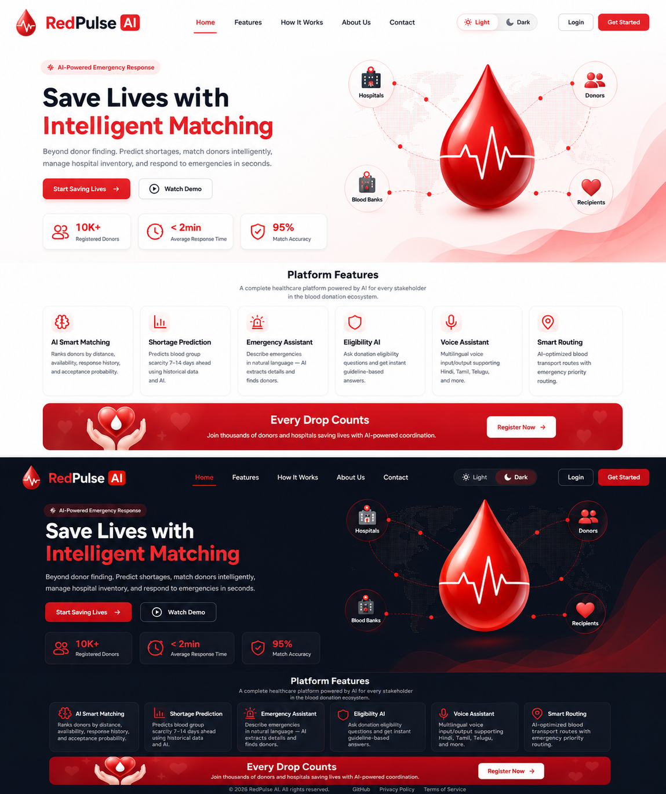
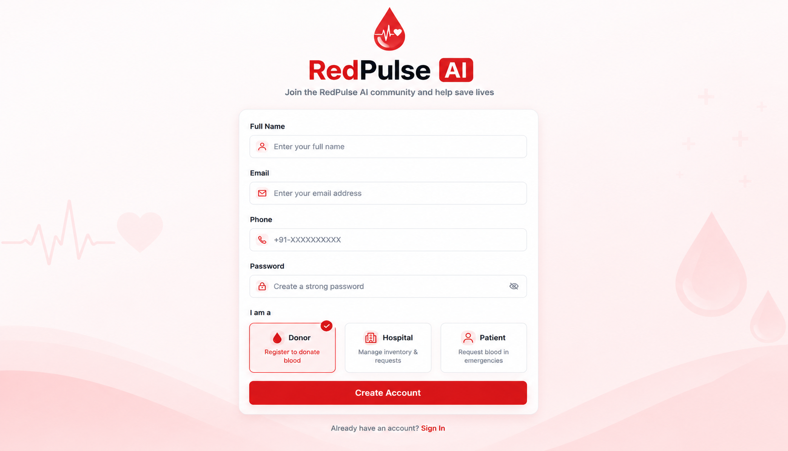
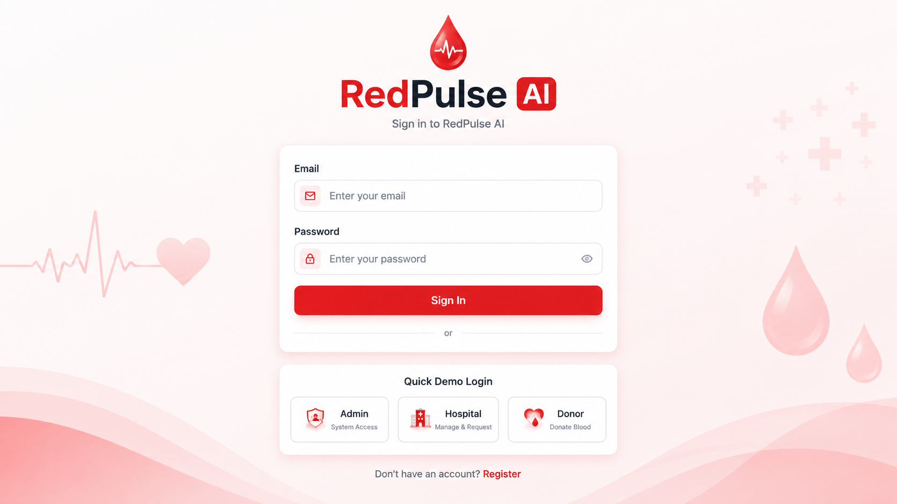

# 🩸 RedPulse AI


**AI-powered emergency blood coordination platform connecting donors, recipients, hospitals, and blood banks.**

> "Every Second Matters. RedPulse AI finds the right donor before time runs out."

---

## 📌 Overview

RedPulse AI is a centralized platform that solves a real, life-critical problem: during medical emergencies, finding compatible blood quickly is difficult because donor information is fragmented across phone calls, social media, and manual hospital records.

The platform connects **donors, recipients, hospitals, and blood banks** through a centralized web application that intelligently recommends suitable donors based on blood group compatibility, eligibility, location, availability, and response history cutting emergency coordination time from hours to minutes.

---

## 🚨 The Problem

- **118 million+** blood donations are collected globally every year *(WHO, Blood Safety and Availability Fact Sheet)*, yet patients still face delays during emergencies.
- Hospitals rely on manual donor search — phone calls, WhatsApp groups, personal networks.
- No unified system connects donors, hospitals, and blood banks in real time.
- Rare blood groups are especially hard to locate quickly.
- Blood banks have limited real-time visibility into inventory across locations.

---

## 💡 The Solution

RedPulse AI provides:

- **Emergency request posting** — hospitals and blood banks post urgent blood requirements
- **Intelligent Donor Recommendation Engine** — ranks eligible donors by blood group compatibility, distance, eligibility, and response reliability
- **Real-time notifications** — donors receive instant alerts and can accept/decline
- **Role-based dashboards** — for donors, recipients, hospitals, and blood banks
- **Live geographic heatmap** — visualizes blood demand and donor availability
- **Demand forecasting (prototype)** — flags potential shortages using historical trends
- **Donation history & eligibility tracking** — for safe, reliable donations

---

## 🎨 Design

### Logo


### Web Interface



### Registration Page



### Sign In Page



---

## 🧠 Why AI Instead of Manual Search?

```
Traditional Approach                    RedPulse AI Approach

Emergency Request                       Emergency Request
      │                                       │
      ▼                                       ▼
Search Donor List                    Recommendation Engine
Manually                                       │
      │                                       ▼
      ▼                              Score & Rank Every
Call One Donor                       Eligible Donor
at a Time                                     │
      │                                       ▼
      ▼                              Instant Notification
   Wait...                                    │
      │                                       ▼
      ▼                              Hospital Confirmation
 Slow Response                                │
                                               ▼
                                       Fast Response
```

Manual filtering doesn't scale under time pressure — ranking and prioritization matter more than simply having a list of donors.

---

## ⚙️ Detailed System Flow

### 1. Request Initiation
- A hospital, blood bank, or recipient submits a blood request through the web app.
- Required fields: blood group, units needed, urgency level, patient condition summary, hospital location.
- Request is written to the `requests` collection in MongoDB with status `PENDING`.

### 2. Urgency Interpretation
- The **Priority Classification module** evaluates the request and assigns a severity tag: `CRITICAL`, `HIGH`, `MEDIUM`, or `LOW`.
- Classification is based on structured inputs (e.g., unit quantity vs. available inventory, patient condition flags, time since request creation) rather than free-text interpretation.
- Status updates to `CLASSIFIED`.

### 3. Inventory & Availability Check
- The **Inventory Service** queries the hospital/blood bank's current stock for the requested blood group.
- If sufficient stock exists locally, the request can be fulfilled from inventory directly, skipping donor search.
- If stock is insufficient, the flow proceeds to donor matching.

### 4. Donor Recommendation & Ranking
- The **Recommendation Engine** queries the `donors` collection for candidates matching:
  - Blood group compatibility (including compatible cross-matches, not just exact type)
  - Geographic proximity (via Google Maps API distance calculation)
  - Eligibility status (last donation date, health flags, minimum interval since last donation)
  - Historical response rate (ratio of accepted vs. ignored past requests)
- Each candidate donor receives a **weighted suitability score** combining these four factors.
- Donors are ranked, and the top N (configurable, e.g., top 10) are selected for notification.

### 5. Notification Dispatch
- The **Notification Service** sends real-time alerts via Firebase Cloud Messaging to the ranked donor list.
- Notifications include: blood group needed, urgency level, hospital name and distance, and an Accept/Decline action.
- Requests are sent in ranked order — top-ranked donors are notified first; if no response within a configurable window, the next tier is notified.

### 6. Donor Response
- Donor accepts → status updates to `ACCEPTED`, hospital is notified, and the donor is removed from the active notification pool for this request.
- Donor declines or times out → next-ranked donor is notified automatically.

### 7. Hospital Confirmation
- Hospital staff confirm the donor's arrival and completed donation through their dashboard.
- Request status updates to `FULFILLED`.

### 8. Inventory & History Update
- Blood inventory is updated to reflect the new unit(s) collected.
- Donor's donation history is updated (last donation date, total donations, response record) — this feeds back into future eligibility and response-rate scoring.

### 9. Analytics & Heatmap Refresh
- The completed request feeds into the analytics pipeline, updating:
  - The live heatmap (demand vs. availability by region)
  - The demand forecasting model's historical dataset (prototype)
  - Dashboard metrics (active requests, fulfillment rate, average response time)

```
┌─────────────────────┐
│  Request Initiation │
└──────────┬───────────┘
           ▼
┌─────────────────────┐
│ Urgency Classification│
└──────────┬───────────┘
           ▼
┌─────────────────────┐
│ Inventory Check      │──── Sufficient stock ────► Fulfilled directly
└──────────┬───────────┘
           │ Insufficient
           ▼
┌─────────────────────┐
│ Donor Recommendation │
│ & Ranking Engine     │
└──────────┬───────────┘
           ▼
┌─────────────────────┐
│ Notification Dispatch│◄──── Re-notify next tier
└──────────┬───────────┘        (on decline/timeout)
           ▼
┌─────────────────────┐
│ Donor Response       │
└──────────┬───────────┘
           │ Accepted
           ▼
┌─────────────────────┐
│ Hospital Confirmation│
└──────────┬───────────┘
           ▼
┌─────────────────────┐
│ Inventory & History  │
│ Update               │
└──────────┬───────────┘
           ▼
┌─────────────────────┐
│ Analytics & Heatmap │
│ Refresh             │
└─────────────────────┘
```

---

## 🏗️ System Architecture

### High-Level Architecture

```
                              Users
                                │
                                ▼
                       React Frontend (SPA)
                                │
                                ▼
                        FastAPI Backend (REST API)
        ┌───────────────┬───────────────┬───────────────┐
        │               │               │               │
  Authentication   Recommendation   Notification     Inventory
     Service           Engine          Service          Service
        │               │               │               │
        └───────────────┴───────┬───────┴───────────────┘
                                 ▼
                            MongoDB
                                 │
        ┌────────────────────────┼────────────────────────┐
        ▼                        ▼                        ▼
   Heatmap Module          Analytics Module         Forecasting Module
                                                        (Prototype)
```

### Component Breakdown

**Frontend (React + Tailwind CSS)**
- Role-based routing: separate dashboard views for Donor, Recipient, Hospital, Blood Bank
- State management for live request status and notifications
- Map integration (Google Maps API) for heatmap and distance visualization

**Backend (FastAPI)**
- `auth/` — JWT-based authentication, role-based access control (RBAC)
- `requests/` — CRUD operations for blood requests, status transitions
- `recommendation/` — scoring and ranking logic for donor matching
- `notifications/` — Firebase Cloud Messaging integration, notification queueing
- `inventory/` — blood stock tracking per hospital/blood bank
- `analytics/` — aggregates data for dashboards and heatmap
- `forecasting/` — scikit-learn based shortage prediction (prototype, trained on sample historical data)

**Database (MongoDB)**
Collections:
- `users` — donors, recipients, hospital staff, blood bank staff (role field distinguishes type)
- `requests` — blood requests with status, urgency, timestamps
- `donors` — donor-specific fields: blood group, eligibility, last donation date, response history
- `inventory` — per-facility blood stock by type
- `notifications` — notification log per request/donor pair

**External Services**
- Google Maps API — distance calculation, heatmap rendering
- Firebase Cloud Messaging — push notifications
- Docker — containerized deployment for backend and frontend

### Data Flow Summary

```
Frontend ──HTTP/REST──► FastAPI ──Query/Write──► MongoDB
                            │
                            ├──► Google Maps API (distance, geocoding)
                            └──► Firebase Cloud Messaging (notifications)
```

---

## 🌟 Key Features

- Emergency Request Management
- Intelligent Recommendation Engine
- Real-Time Notifications
- Emergency Priority Classification
- Role-Based Dashboards
- Live Heatmap
- Inventory Intelligence
- Demand Forecasting *(Prototype)*
- Rare Blood Registry

---

## 🛠️ Tech Stack

| Layer | Technology |
|---|---|
| Frontend | React, Tailwind CSS |
| Backend | FastAPI (Python) |
| Database | MongoDB |
| Recommendation Engine | Python |
| Forecasting | scikit-learn *(Prototype)* |
| Maps & Geolocation | Google Maps API |
| Notifications | Firebase Cloud Messaging |
| Authentication | JWT |
| Deployment | Docker |

---

## 📂 Project Structure

```
redpulse-ai/
├── backend/
│   ├── app/
│   │   ├── routes/
│   │   ├── models/
│   │   ├── services/
│   │   │   ├── recommendation/
│   │   │   ├── notification/
│   │   │   ├── inventory/
│   │   │   └── forecasting/
│   │   └── auth/
│   ├── requirements.txt
│   └── main.py
├── frontend/
│   ├── src/
│   │   ├── components/
│   │   ├── pages/
│   │   └── dashboards/
│   └── package.json
├── docs/
│   └── architecture.md
└── README.md
```

---

## 🚀 Getting Started

### Prerequisites
- Node.js (v18+)
- Python (v3.10+)
- MongoDB (local or Atlas)

### Backend Setup
```bash
cd backend
python -m venv venv
source venv/bin/activate   # Windows: venv\Scripts\activate
pip install -r requirements.txt
uvicorn main:app --reload
```

### Frontend Setup
```bash
cd frontend
npm install
npm run dev
```

### Environment Variables
Create a `.env` file in `backend/`:
```
MONGO_URI=your_mongodb_connection_string
JWT_SECRET=your_jwt_secret
MAPS_API_KEY=your_google_maps_api_key
FIREBASE_CREDENTIALS=path_to_firebase_service_account.json
```

---

## 🔒 Security

- JWT-based authentication
- Role-based access control (RBAC)
- Encrypted communication over HTTPS
- Audit logs for request/response tracking

---

## ✅ Why RedPulse AI?

- Real-world healthcare problem
- Intelligent donor recommendation, not just a filtered list
- Explainable recommendations
- Live emergency coordination
- Inventory intelligence
- Clear architecture with a realistic path from prototype to pilot

---

## 🗺️ Roadmap

- [x] Core donor-hospital matching engine
- [x] Real-time notifications
- [x] Role-based dashboards
- [ ] Live heatmap integration
- [ ] Demand forecasting with real historical data
- [ ] Multilingual support
- [ ] Mobile application
- [ ] SMS emergency alerts
- [ ] Offline support
- [ ] Wearable device integration
- [ ] Government healthcare system integration (e-RaktKosh, ABHA)

---

## 📚 References

### Problem Statement Data
1. World Health Organization (WHO) — *Blood Safety and Availability Fact Sheet*.
   Source for global blood donation volume (118 million+ donations collected annually) and the ~85% voluntary unpaid donor rate used in the problem statement.
   https://www.who.int/news-room/fact-sheets/detail/blood-safety-and-availability

### Market & Industry Data
2. Grand View Research — *AI in Healthcare Market Size, Share & Growth Report*.
   Source for the $187.7B global AI-in-healthcare market projection by 2030 (38.5% CAGR, 2024–2030).
   https://www.grandviewresearch.com/industry-analysis/artificial-intelligence-ai-healthcare-market

3. Office of the National Coordinator for Health IT (ONC) / American Hospital Association (AHA) — *IT Supplement Survey*, 2023–2024.
   Source for U.S. hospital predictive-AI adoption figures (66% in 2023, 71% in 2024).

### Existing Systems Referenced (Competitive Landscape)
4. e-RaktKosh — Government of India's centralized blood bank management system.
   https://www.eraktkosh.in

5. ABHA (Ayushman Bharat Health Account) — India's national digital health ID framework, referenced as a future integration target.
   https://abha.abdm.gov.in

### Technology & Frameworks
6. React — JavaScript library for building user interfaces.
   https://react.dev

7. FastAPI — Python web framework for building APIs.
   https://fastapi.tiangolo.com

8. MongoDB / PostgreSQL — database documentation (per current architecture version).
   https://www.mongodb.com/docs | https://www.postgresql.org/docs

9. scikit-learn — Python machine learning library used for the forecasting prototype.
   https://scikit-learn.org

10. Google Maps Platform — geolocation, distance calculation, and mapping APIs.
    https://developers.google.com/maps

11. Firebase Cloud Messaging — real-time push notification service.
    https://firebase.google.com/docs/cloud-messaging

12. JSON Web Tokens (JWT) — authentication standard.
    https://jwt.io/introduction

### Security Standards (Design Principles Referenced)
13. OWASP — Role-Based Access Control and API security best practices referenced in the security design.
    https://owasp.org

---

## 👥 Team

| Name | Role |
|---|---|
| [Name] | Frontend Development |
| [Name] | Backend & Database |
| [Name] | Recommendation Engine / Matching Logic |
| [Name] | UI/UX & Presentation |

---

## 📄 License

This project is licensed under the MIT License — see the [LICENSE](LICENSE) file for details.

*"One donation can save three lives. One smart platform can save thousands."*
```
